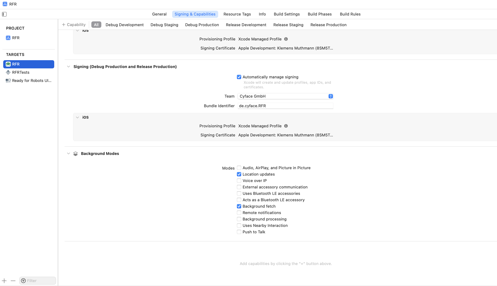
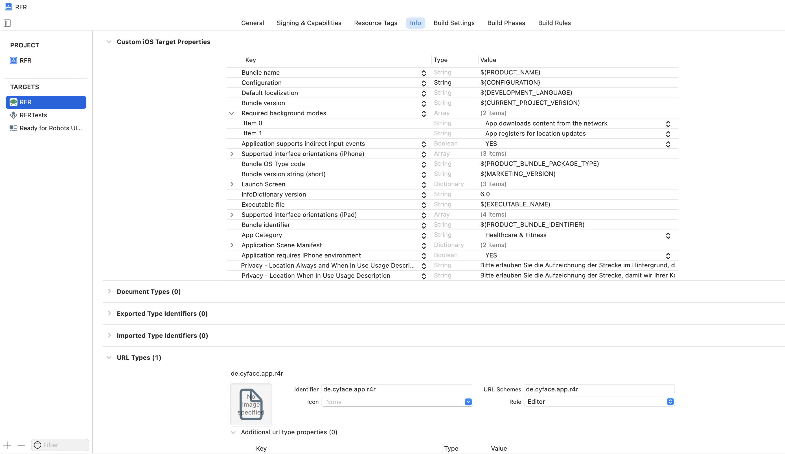
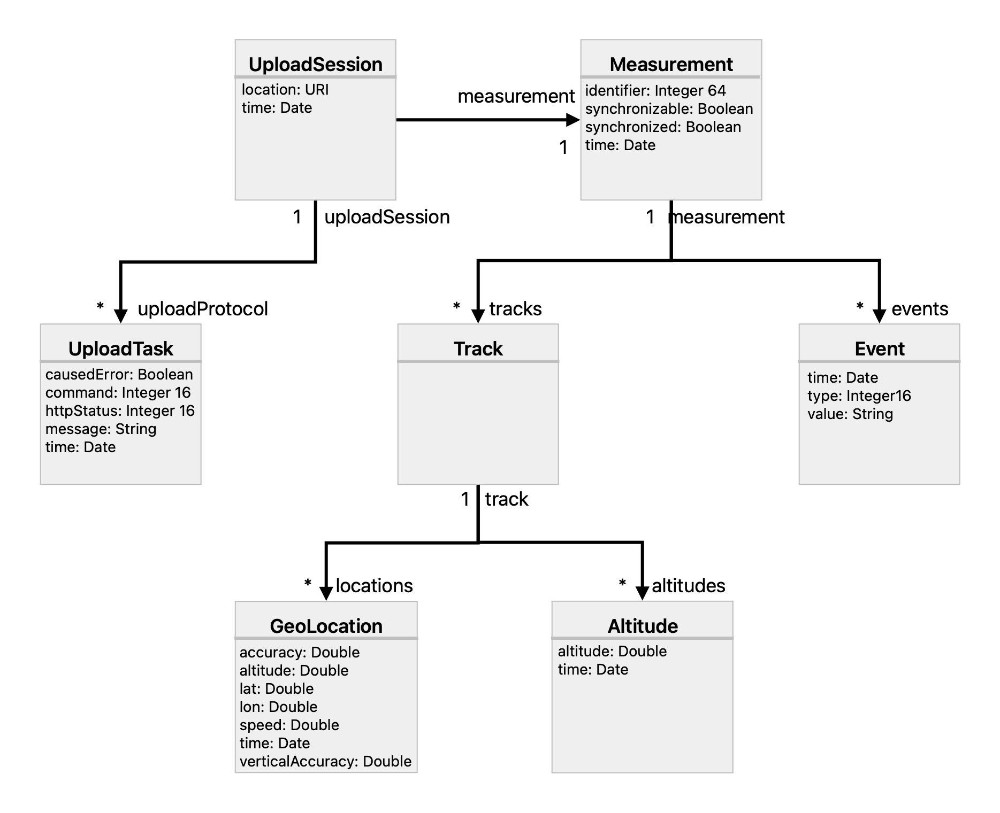

#  Cyface iOS - SDK
[](https://www.gnu.org/licenses/gpl-3.0)
[](https://swift.org)

## Introduction

This Repository contains the Cyface SDK for iOS. 
It enables iOS applications to continuously measure positioned sensor data from devices running iOS (i.e. iPhone).
It is mostly used to measure traffic data for different modalities, like walking, cycling or driving.
The framework is developed by the [Cyface GmbH](https://cyface.de) and mostly used to measure cycling behaviour with the purpose of improving the cycling infrastructure based on the measured data.

The measured data are the Global Navigation Sattelite System (GNSS) information, height data from the barometer if available as well as data provide by the phones inertial measurement unit (IMU).
IMU timeline data comes from the accelerometer, gyroscope and compass, each with 3 axis in space.

The framework provides three core features, which are *capturing data*, *accessing captured data for local display* and *transmitting captured data to a [Cyface Data Collector Server](https://github.com/cyface-de/data-collector)*.

## Permissions
The Cyface SDK requires permissions to use location services and data uploads in the background.
These permissions have to be declared as part of the App using the Cyface SDK.

Allowing background location updates is described in the [Apple Developer Documentation](https://developer.apple.com/documentation/corelocation/getting_the_user_s_location/handling_location_events_in_the_background).

Asking for the proper permissions is described in the [Apple Developer Documentation](https://developer.apple.com/documentation/corelocation/requesting_authorization_for_location_services) as well. 
Applications using the Cyface SDK require at least "Location When In Use Usage Description" and "Location Always and When In Use Usage Description".
Code to ask the user to grant these permissions is included with the SDK and executed on the first call to ``Measurement/start()``.

Please refer to the example applications distributed with the Cyface SDK to see the correct setup in action.
Basically you need to enable background modes like shown in the following image:



There are also some settings required in the *Info.plist* file, like shown here:



## The Measurement Lifecycle - Starting and Stopping Data Capturing

The concept of a `Measurement` forms the heart of continuous capturing position and sensor data from a mobile device, using the Cyface SDK.
The measurement lifecycle is quite simple, following the cycle of ``Measurement/start()`` and ``Measurement/stop()``.
It is possible to pause and resume a running measurement using ``Measurement/pause()`` and ``Measurement/resume()``.
The lifecycle follows the ``Measurement`` protocol, which looks like:

```Swift
public protocol Measurement {
    var measurementMessages: PassthroughSubject<Message, Never> { get }
    var isRunning: Bool { get }
    var isPaused: Bool { get }
    func start() throws
    func stop() throws
    func pause() throws
    func resume() throws
    func changeModality(to modality: String)
}
```

You can see the four lifecycle methods mentioned above.

The two flags `isRunning` and `isPaused` must be set correctly by implementations of `Measurement`.
Both provide information about the current state of the measurement itself.

The `measurementMessages` is a *Combine* publisher sending information about the current state of the measurement.
A subscriber to this publisher can expect to receive the following messages in the form of ``Message`` objects:

* **capturedLocation(GeoLocation):** This message is sent everytime a new position was captured.
* **capturedAltitude(Altitude):** This message is sent everytime a new altitude value was captured.
* **capturedAcceleration(SensorValue):** This message is sent everytime a new acceleration value was captured.
* **capturedRotation(SensorValue):** This message is sent everytime a new rotation value was captured.
* **capturedDirection(SensorValue):** This message is sent everytime a new direction value was captured.
* **started(timestamp: Date):** This message is sent once after a measurement was successfully started.
* **stopped(timestamp: Date):** This message is sent once after a measurement was successfully stopped.
* **paused(timestamp: Date):** This message is sent everytime a measurement was successfully paused.
* **resumed(timestamp: Date):** This message is sent everytime a measurement was successfully resumed.
* **hasFix:** This message is sent everytime the system has acquired a GNSS fix.
* **fixLost:** This message is sent everytime the system has lost its GNSS fix.
* **modalityChanged(to: String):** This message is sent everytime the system changed the modality of the current measurement. This is the mode of transportation used at the moment like BICYCLE, CAR, etc.

The Cyface SDK provides one default adoption of the `Measurement` protocol.
This is called ``MeasurementImpl``.

Creating a ``Measurement`` and controlling its lifecycle should look like this:

```Swift
let measurement = MeasurementImpl()

let messagesCancellable = measurement.measurementMessages.sink(receiveCompletion: { status in
    switch status {
        case .finished:
            // Do everything necessary after the last message was receiveid
        case .failure(_):
            // This should probably not happen, but if it does something is seriously wrong. At least log the error so it becomes possible to debug.
    }

}) { message in
    switch message {
        case .capturedLocation(let location):
            // handle new geo locations here!
        case .capturedAltitude(let altitude):
            // handle new altitudes here!
        case .capturedAcceleration(let acceleration):
            // handle new accelerations here!
        case .capturedRotation(let rotation):
            // handle new rotations here!
        case .capturedDirection(let direction):
            // handle new directions here!
        case .started(timestamp: let timestamp):
            // handle startup of a measurement here!
        case .stopped(timestamp: let timestamp):
            // handle a stopped measurement here!
        case .paused(timestamp: let timestamp):
            // handle pausing a measurement here!
        case .resumed(timestamp: let timestamp):
            // handle resuming a measurement here!
        case .hasFix:
            // handle getting a GNSS fix here!
        case .fixLost:
            // handle loosing the GNSS fix here!
        case .modalityChanged(to: let modality):
            // handle a change in movement mode here!
    }
}

try measurement.start()

// Repeat the following two lines as often as desired
try measurement.pause()
try measurement.resume()

try measurement.stop()
```

After creating `MeasurementImpl` at first a sink is registered with the publisher of `measurementMessages`.
Here all the updates from the measurement should be handled.
For example on each new `.capturedLocation` event, the app updates the current track on some map view.
**ATTENTION:** Do not forget to store the `Cancellable`, returned by sink in this case, in a scope that stays active for as long as you need updates from the measurement.
If the `Cancellable` is not referenced from an active scope the *Combine* pipeline stops.

Afterwards the measurement can start, pause, resume and stop.
These four methods are thread safe.
However if they are called in the wrong order, they are going to throw.

## Data Storage
You can use the captured data directly in your app, display it on screen and transmit it to a Cyface Data Collector Server or your own data storage.
If you need to keep the measured data in between application restarts, you may save it on the device.

You can implement your own data storage if you like by reacting to the messages sent from a running `Measurement` and storing the captured data however you like.

For convenience, the Cyface SDK provides its own data storage layer, which is designed to receive sensor data from a `Measurement` and store it to a permanent storage area.
The default implementation provided with the SDK uses Apples *CoreData* framework.
Two protocols describe the core of the Cyface SDK data storage layer.
The first is the `DataStoreStack` forming an abstraction for storage management, including setup and data migration from an older to a newer version.
It follows the following protocol:

```Swift
public protocol DataStoreStack {
    func setup() async throws                                                               // 1
    func wrapInContext(_ block: (NSManagedObjectContext) throws -> Void) throws             // 2
    func wrapInContextReturn<T>(_ block: (NSManagedObjectContext) throws -> T) throws -> T  // 3
    func nextValidIdentifier() throws -> UInt64                                             // 4
}
```

It is recommended to have exactly one object of this type per application.
The recommended way to achive this is to instantiate it as a property to `UIApplication` for *UIKit* applications or as part of the struct adopting the `App` protocol for *SwiftUI*.
It would probably work to use multiple instances, but this is not guaranteed and unsupported.

**1:** Since the setup of a `DataStoreStack` can be a rather lengthy process, it is put into its own method.
An application must call this method before any other method from this interface.
If that is not done, hard to trace and hard to understand errors might occur from within seemingly random places in your application.
This is especially true if the Cyface SDK default implementation of this interface - which uses *CoreData* - is employed.

**2 and 3:** These two methods realize interaction of application code with persistent code. 
They provide a context, from which it is safe to work on persistent data objects.
Data objects may never leave this context.
Especially if using *CoreData*, managed objects leaving this context, will cause hard to understand errors from seemingly random places in your app.
One way to avoid this, is to copy all the data required into your own, non managed data structures.
Be especially careful with forwarding to other thread contexts such as the main thread (i.e. `DispatchQueue.main.async`).
These are leaving the current context and will lead to errors if they use captured managed objects.
**4:** Is used as a central entry point to generate storage wide unique identifiers usable by new measurements.

The data is stored following a *CoreData* schema file, which is currently available in Version 13.
The supported entities are displayed in the following figure:



* **Measurement:** Represent a single measurement in the database. It has two attributes `synchronizable` and `synchronized`, tracking if it is possible and necessary to synchronize this measurement with a storage server. Each measurement also gets a device wide unique `identifier`, which is implemented as a counter.
* **Track:** A measurement contains one or more tracks. A track is created when the measurement is resumed after a pause.
* **Event:** This tracks user interactions like button presses to manipulate an active measurement. Start, stop, pause and resume events are recorded as this entity as well as modality changes.
* **GeoLocation:** Each captured location is stored as a `GeoLocation` in the data store.
* **Altitude:** Each captured barometric altitude value is stored as an `Altitude` in the data store. This is empty if the device has no barometer.
* **UploadSession:** If the `BackgroundUploadProcess` is used, active sessions are stored here, to resume them when the app is waken up for transmission by the system.
* **UploadTask:** A protocol of the responses received so far in an upload session. This enables the Cyface SDK to repeat uploads even if the app was suspended.

These entities are usable to get and manipulate data in the data storage.
For example to get the state on whether a measurement is synchronizable (finished but not synchronized yet), query the storage as follows:

```Swift
let dataStoreStack = CoreDataStack()
let identifier = 1
try await dataStoreStack.setup()
let measurementIdentifier = try dataStoreStack.wrapInContextReturn { context in
    guard let measurementRequest = context.persistentStoreCoordinator?.managedObjectModel.fetchRequestFromTemplate(
        withName: "measurementByIdentifier",
        substitutionVariables: ["identifier": identifier]
    ) else {
        throw PersistenceError.measurementNotLoadable(identifier)
    }
    guard let measurementMO = try measurementRequest.execute().first as? MeasurementMO else {
        throw PersistenceError.measurementNotLoadable(identifier)
    }

    return measurementMO.synchronizable
}
```

**ATTENTION:** It is important to never use any model object (marked with MO in their model name) outside the thread in which the `NSManagedObjectContext` was created.
Doing so is going to cause strange, meaningless errors at random places througout the application!
Therefore always get the data you need from the model object from within either `wrapInContext` or `wrapInContextReturn` and return only the required data to proceed.
Working with an `NSManagedObjectContext` and model objects is explained in [Apples *CoreData* Documentation](https://developer.apple.com/documentation/coredata).

The second protocol `CapturedDataStorage` connects to a running `Measurement` and stores captured data to an underlying storage layer, such as the one provided by an implementation of `DataStoreStack`.
It looks like:

```Swift
public protocol CapturedDataStorage {
    func subscribe(to measurement: Measurement, _ initialMode: String, _ receiveCompletion: @escaping ((_ databaseIdentifier: UInt64) async -> Void)) throws -> UInt64
    func unsubscribe()
}
```

It can subsribe to a `Measurement` and unsubscribe from all measurements like so:

```Swift
let storage = CapturedCoreDataStorage(dataStoreStack, 1)

let databaseIdentifier = storage.subscribe(to: measurement, "BICYCLE") { databaseIdentifier in
    // Handle storage for measurement was complete. For example refresh the user interface here.
}

storage.unsubscribe()
```

Subscribing to a measurement provides an application wide unique identifier, used to identify that measurement inside the data store.

If the measurement is finished, no additional events are expected.
After this happens, the completion handler `receiveCompletion` gets called.

## Data Synchronization

The Cyface SDK allows to synchronize the measured data to a server for permanent storage.
The default way to store data is to a [Cyface Data Collector Server](https://github.com/cyface-de/data-collector).
But the SDK is extensible and allows injection of a custom upload process, for synchronizing to different servers supporting different data formats and communication protocols.
Extensions are discussed in *Provide a Customized Upload Process*.

### The Cyface Data Collector

Upload to the Cyface Data Collector is the default way to upload data.
The Collector expects to receive a binary format specified using [Protobuf](https://protobuf.dev/).
The specification is available from [Github](https://github.com/cyface-de/protos).

To send the data the Data Collector implements the [Google Media Upload Protocol](https://developers.google.com/drive/api/guides/manage-uploads?hl=de#resumable).
Two implementations are available:

* `DefaultUploadProcess`
* `BackgroundUploadProcess`

Additional processes are possible, as described under *Provide a Customized Upload Process* below.

To exchange the different ``UploadProcess`` instances, there is a builder for objects adopting that protocol.
The ``UploadProcessBuilder`` creates the correct instance depending on its implementation.
Methods requiring an UploadProcess forward the creation to an implementation of builder, to create the correct type, while also leaving the type interchangeable.

### Authentication

Applications transmitting data to a Cyface Data Collector or a custom collector service usually require authentication and authorization.
The SDK supports two authentication variants, implemented by `OAuthAuthenticator` and `StaticAuthenticator`.
Both adopt the `Authenticator` protocol which looks like:

```Swift
public protocol Authenticator {
    func authenticate() async throws -> String
    func delete() async throws
    func logout() async throws
    func callback(url: URL)
}
```

The method `authenticate` is the core of an `Authenticator`, providing a valid auth token in case of success or throwing an error if failed.
The `delete` method deletes a user account.
This is only possible if the server supports this via API.
The `logout` method can be used to logout a user.
What this means depends on the authentication method.
An application should usually forward back to the login screen in case of a successful logout.
The `callback` method 

The simplest is the `StaticAuthenticator`.
It is provided with an authentication token, used during an upload process.
If a new token is required a new istance of this class is necessary.
This implementation only supports `authenticate`.
Other functions are going to throw ``AuthenticationError/notImplemented`` if called.
The `StaticAuthenticator` is not the recommended way of authentication.

The `OAuthAuthenticator` implements authentication using OpenID / OAuth 2.0 using Auth Flow with PCKE.
It has been tested with a Keycloak Identity provider (Version 22.0.0), but should work with all Identity Providers supporting the same standards.
Using an `OAuthAuthenticator` is as easy as calling:

```Swift
let authenticator = OAuthAuthenticator(issuer: issuer, redirectUri: redirectURI, apiEndpoint: apiEndpoint, clientId: clientId)

let token = try await authenticator.authenticate()
```

The values for `issuer`, `redirectURI`, `clientId` and `apiEndpoint` depend on the server setup.
The first three are subject to the identity provider (i.e. Keycloak).
The `apiEndpoint` is used to communicate with the resource server for user deletion.
If the resource server provides an endpoint to send an HTTP `DELETE` request, the `delete` method is supported that way.

If neither of the two provided `Authenticator` implementations satisfies an applications needs for authentication and authorization, that application could easily adopt the `Authenticator` protocol, to provide custom authentication and authorization.


### Synchronizing Measurement Data
To use the default upload process simply call it with a `FinishedMeasurement`, like so:

```Swift
let urlSession = URLSession(configuration: configuration)

let sessionRegistry = DefaultSessionRegistry()
let uploadFactory = CoreDataBackedUploadFactory(dataStoreStack: dataStoreStack)

var uploadProcess = DefaultUploadProcess(openSessions: sessionRegistry, apiUrl: apiURL, urlSession: mockedSession, uploadFactory: uploadFactory, authenticator: authenticator)

let result = try await oocut.upload(measurement: mockMeasurement)
```

Note that this method expects an `Authenticator` a `SessionRegistry` and an `UploadFactory` from the Cyface SDK as well as a `URLSession` and an API URL.

Acquiring an `Authenticator` is described above.

A `SessionRegistry` is used to store information about the progress of an upload session.
This allows for the continuation of cancelled or failed uploads.
The default implementation stores sessions only in memory.
This means updates need to start from the beginning if the application was closed.
The `PersistentSessionRegistry` allows to load sessions from permanent storage and thus to continue uploads, even if the application was suspended or closed.

An `UploadFactory` is responsible for the creation of new `Upload` instances.
It is required for the injection of different `Upload` implementations, which is useful for mocking `Upload` instances during testing and for SwiftUI previews.

### Synchronizing Data in the Background

The `DefaultUploadProcess` fails if the application is put to the background or suspended by the system.
To avoid this fate, there is also a `BackgroundUploadProcess`.
This one is capable to handle a background upload.

Create one using a ``BackgroundUploadProcessBuilder``, then simply call ``BackgroundUploadProcess/upload(measurement:)`` to start the upload.
This could look something like:

```Swift
let registry = PersistentSessionRegistry(dataStoreStack: dataStoreStack, uploadFactory: uploadFactory)

let processBuilder = init(
        sessionRegistry: registry,
        collectorUrl: url,
        uploadFactory: uploadFactory,
        dataStoreStack: dataStoreStack,
        authenticator: authenticator
    )
let process = processBuilder.create()
process.upload(measurement: measurement) async throws -> any Upload
```

To ensure, that uploads are continued after the app was suspended a `PersistentSessionRegistry` is required.

## Provide a Customized Upload Process

In case an Application sends its data to a Server, which does not implement the Cyface Data Collector API and file format, it is possible to adopt the ``UploadProcess`` protocol.
The ``UploadProcess`` protocol looks like:

```Swift
public protocol UploadProcess {
    
    var uploadStatus: PassthroughSubject<UploadStatus, Never> { get }                                    // 1

    mutating func upload(measurement: FinishedMeasurement, authToken: String) async throws -> any Upload // 2
}
```

The `uploadStatus` variable at (1) should be used to send information about the state of the upload.
The inline documentation of the ``UploadStatusType`` provides details about the different states an upload can have.
They are:

* started: Which should occur right before starting the upload.
* finishedSuccessfully: Which should occur right after uploading a measurement was successful.
* finishedUnsuccessfully: Which should occur right after uploading a measurement was not successful.
* finishedWithError(cause: Error): Which should occur right after an error occurred during the upload.

The difference between `finishedUnsuccessfully` and `finishedWithError` being that an upload `finishedUnsuccessfully` if the server returned some error code, while `finishedWithError` indicates some local error on the client not caused by communicating with the server.

The `upload` method takes the measurement and a token for authentication and initiates the upload sequence.
The things happening in there depend on the upload protocol and data format of your application.
In the end the method returns the processed `Upload`.

## Conclusion

These explanations should ease getting used to using the Cyface SDK.
Additional documentation is available for each public member and the test - located in *Tests* - provide additional example code on how to achive certain tasks.

### API Documentation
[See](https://cyface-de.github.io/ios-backend/documentation/datacapturing/)

## Building from Source

The following are some notes and remarks on releasing a new version of the Cyface Mobile SDK for iOS.

### Generate Interface to Protocol Buffer
We use protobuf to transmit data.
Before this works you need to install the Swift Protobuf compiler for example using homebrew: 

```
brew install swift-protobuf
```

If this succeeds, code generation should work automatically.
If any hicups occur, detailed information might be available from the [Swift Protobuf Github Page](https://github.com/apple/swift-protobuf/)

### Linting
Contains [swiftlint](https://github.com/realm/SwiftLint).

## Releasing a new Version
* Always work on a new branch based on main conforming to the pattern "release-<major>.<minor>.<fix>_PROJ-TASKNUMBER
* Create PR into release branch
* Check Version and Since Tags on all added and changed files
* Add `Since` Tag with new version number to all newly added classes.
* Check Readme (Is it up to date with the most recent changes?)
* After approval merge into release and tag the merge commit with `git tag - <major>.<minor>.<fix>` appropriately
* Make the tag to a release on Github and explain the changes following "Keeping a Changelog"


## License
Copyright 2017-2024 Cyface GmbH

This file is part of the Cyface SDK for iOS.

The Cyface SDK for iOS is free software: you can redistribute it and/or modify
it under the terms of the GNU General Public License as published by
the Free Software Foundation, either version 3 of the License, or
(at your option) any later version.

The Cyface SDK for iOS is distributed in the hope that it will be useful,
but WITHOUT ANY WARRANTY; without even the implied warranty of
MERCHANTABILITY or FITNESS FOR A PARTICULAR PURPOSE. See the
GNU General Public License for more details.

You should have received a copy of the GNU General Public License
along with the Cyface SDK for iOS. If not, see <http://www.gnu.org/licenses/>.
